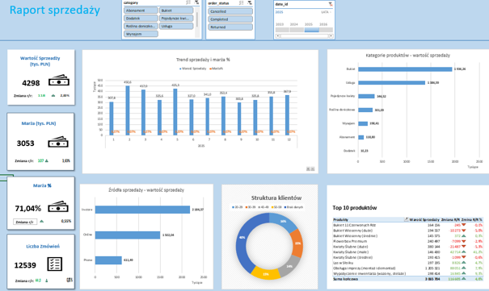

Interactive Sales Dashboard in Excel  
  
This project presents an interactive sales dashboard created in Microsoft Excel. Its purpose is to monitor sales   performance, profit margin, order volume and customer structure.  
The dashboard presents the main business KPIs:  
•	sales value: PLN 4.298 million,  
•	margin value: PLN 3.053 million,  
•	margin percentage: 71.04%,  
•	number of orders: 12,539.  
The report allows users to analyse monthly sales and margin trends, compare product categories and evaluate the performance of different sales channels: in-store, online and phone sales. It also includes a ranking of the top 10 products and an analysis of customers by age group.  
Interactive slicers make it possible to filter the results by product category, order status and year. The dashboard helps identify the best-selling products, the most profitable categories and the main sources of sales revenue.  
This project demonstrates my skills in:  
•	data preparation and cleaning,  
•	creating PivotTables and PivotCharts,  
•	designing business KPIs,  
•	building interactive slicers,  
•	sales and margin analysis,  
•	creating clear and user-friendly business dashboards in Excel.  

